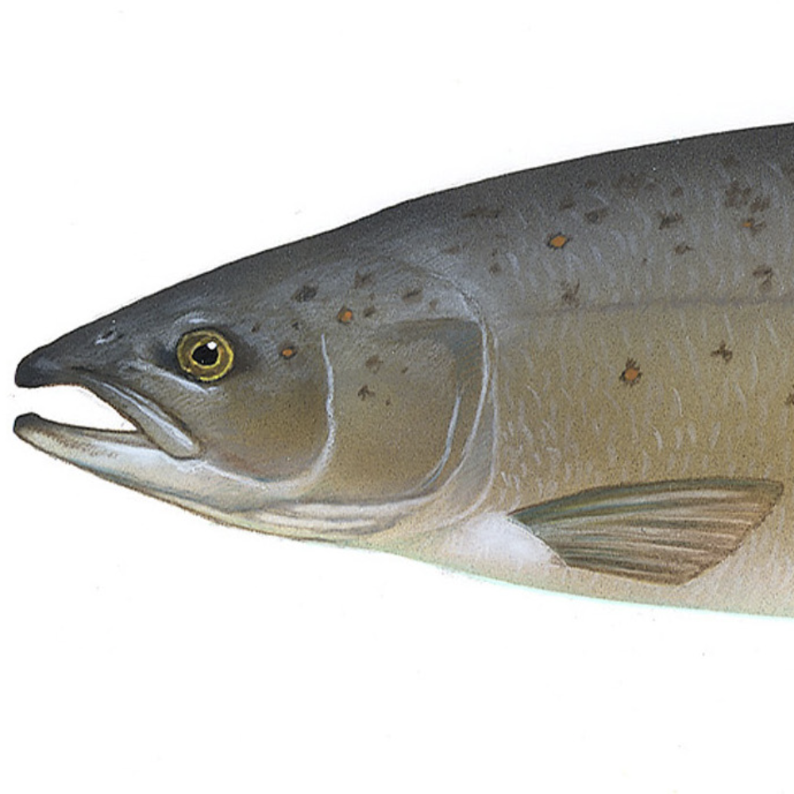

# LedgerLoops Strategy Pit

This repository is an experimentation ground for LedgerLoops strategies.
Some strategies will integrate discovery of loops with negotiation of exchange rates, others may keep them separate.

The strategies are tested in different network models and with different network topologies.

## Network simulators
### Basic
In the basic network simulator, nodes Alice and Bob can become neighbours with:
```js
const alice = new Node('alice');
const bob = new Node('bob');
alice.meet(bob);
```
After that, Alice can contact Bob, for instance with a `Meet` message:
```js
class MyStrategy extends Node {
  meet(other: Node): void {
    this.addFriend(other);
    other.receiveMessage(new Meet(this));
  }
  receiveMessage(sender: string message: Message): void {
    if (message.getMessageType() === `meet`) {
      this.addFriend(sender);
    }
  }
}
```
The `Meet` message will give Bob a handle to Alice, so now they can send each other
any message they want:
```js
bob.receiveMessage(this, new Probe('435af3b4'));
```
A `Node#receiveMessage` call may trigger other messages to be sent, so make sure that this doesn't get into an infinite loop.
This in itself means that this network simulator is not Byzantine fault tolerant, because nodes have infinite patience in this model.
Only one node is acting at a time, and while it is acting, all other nodes are completely asleep until the acting node responds.

### Message ticks
The message ticks model (not implemented yet) improves upon the basic network simulator in that each node gets a change to execute on each clock tick,
and messages sent during clock tick `n` will be delivered in clock tick `n+1`.
Each node is allowed to act on each of the events that have been queued up for it (messages or otherwise), for unlimited time, so if one node gets into an infinite loop
or long sleep, all other nodes will sleep too.

### Message ticks with timeouts
The message ticks with timeouts model (not implemented yet) improves upon the message ticks network simulator in that on each clock tick, each node is allowed to act on each of the events that have been queued up for it (messages or otherwise), for up to a set limit (e.g. 1000ms per event).

## Network Topologies
### Triangle
The simplest network topology has 3 nodes (Alice, Bob and Charlie), and its links evolve as follows:
1. None.
2. Alice->Bob.
3. Alice->Bob, Bob->Charlie.
4. Alice->Bob, Bob->Charlie, Charlie->Alice.

### Hour Glass
This network topology has 5 nodes (Alice, Bob, Charlie, Dave and Edward), and its links evolve as follows (Alice is at the center where two triangles meet):
1. None.
2. Alice->Bob.
3. Alice->Bob, Bob->Charlie.
4. Alice->Bob, Bob->Charlie, Charlie->Alice.
5. Alice->Bob, Bob->Charlie, Charlie->Alice, Alice->Dave.
6. Alice->Bob, Bob->Charlie, Charlie->Alice, Alice->Dave, Dave->Edward.
7. Alice->Bob, Bob->Charlie, Charlie->Alice, Alice->Dave, Dave->Edward, Edward->Alice.

## Current Strategies
###   Stingray
The Stingray has a more detailed data storage (both for Flood Probes and for Trace Probes) than its predecessors Salmon, Pelican and Petrogale.
A Stingray reacts to events with actions. Events are:
* Meet - a new neighbour is added. Although neighbour links are symmetrical, the Meet event is triggered in only one of the two parties
* Receiving a Meet message (being the other party in a Meet)
* Receiving a Probe message from a neighbour
* Receiving a Trace message from a neighbour

Actions are:
* Mint a probe and send it to one or more neighbours
* Forward an incoming probe to one or more neighbours
* Mint a Trace and send it to a neighbour
* Forward an incoming Trace to a different neighbour
* Conclude that a loop exists

A Stingray will behave as follows:
For every Meet, mint a probe and send it to all neighbours (including the new one)
For every incoming probe:
* if it is unknown, forward it to all other neighbours (not including the sender)
* if it is known, home-minted and *virgin for that sender* (see below), mint a trace and send that to just the sender of the probe
* in all other cases (i.e. known but not home-minted and/or not virgin for the sender), mint a probe and send that to just the sender of the probe (we call this is a "pinning probe")
For every incoming trace:
* if it was home-minted, conclude that a loop exists
* if it was not home-minted, look at the Probe ID it relates to, and forward it to the neighbour who originally sent you that probe (a Trace backtraces a probe).

A Probe is *virgin* for a neighbour if it was never sent to them and never received from them.

## Previous Strategies
###  Salmon

The Salmon strategy works as follows:
When a Salmon Node meets a new node, it:
* adds this node as a contact
* sends that new a Meet message
* mints a new Probe message
* sends it to all
* considers its chronological list of contacts (including the new one)
* sends the probe to the oldest contact
* unless this results in a loop being found from this probe, sends it to the next contact in the list
* repeat for all contacts in the list (including the new one)

When a Salmon Node receives a Meet message:
* add this node as a contact
* deduplicate on `node->getName()`
* throw an error in case a contact by that name already exists)

When a Salmon Node receives a Probe message:
* store it
* deduplicate on Probe Id
* if a probe by this Probe Id already exists, conclude that a loop is found (see below)
* else forward this probe to all other contacts

When a Salmon Node finds a loop:
* send a Loop message for this loop's Probe Id to all contacts
* mark this loop as known (deduplicate on Probe Id)

When a Salmon Node receives a Loop message:
* if it is already marked as known, do nothing
* otherwise, mark it as known, and
* forward it to all other contacts (note that this is a bug, see below)

Three Salmons in a Triangle in the Basic simulator will successfully find three loops.
They will not be able to detect that the three loops have exact overlap.
They rely on the fact that a triangle has no forks.
Forwarding a Loop message to all other contacts is a bug unless the number of other contacts is exactly one. This bug goes undetected in the Triangle topology, but Salmon loop detection would break if you put them in an Hourglass topology.

Also, Salmons don't implement exchange rate negotiation.

###  Pelican

Pelicans differ from Salmons in that they create multiple Loops per Probe - forking them whenever the network forks. This means they can handle not only the Triangle but also the Hourglass topology.

Due to a bug in a mechanism that was meant to prevent unnecessary probes to a newly met node, nodes in the second triangle
don't get to see all the probes and loops.

###   Petrogale

The Petrogale is identical to the Pelican except that it always sends all existing probes to a newly met node, even if
loops were already found for them.

I think in the hourglass test, the first triangle is found 3 times and the second triangle is found 8 times, although it's
hard to tell because of #1 and #2.
